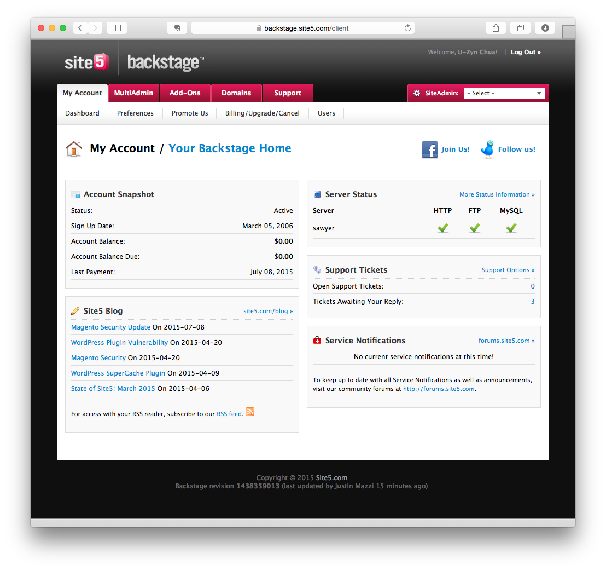

Finally bidding my 9.5-year-old host goodbye.

It has been a long time coming as I now run a [consulting firm](http://zynesis.com/) and manages quite a few servers myself and yet I still own a _traditional_ shared hosting account. 

Moving away from it is not as easy as it sounds after so much stuff has accumulated on a 9+ year-old account, from not only a few PHP demo sites, some backups, DNS entries (these were quite a mess), to some of my friends' websites (as I was already paying a fixed monthly fee, why not host them too, for free).

Finally, it's done. 

So long!
